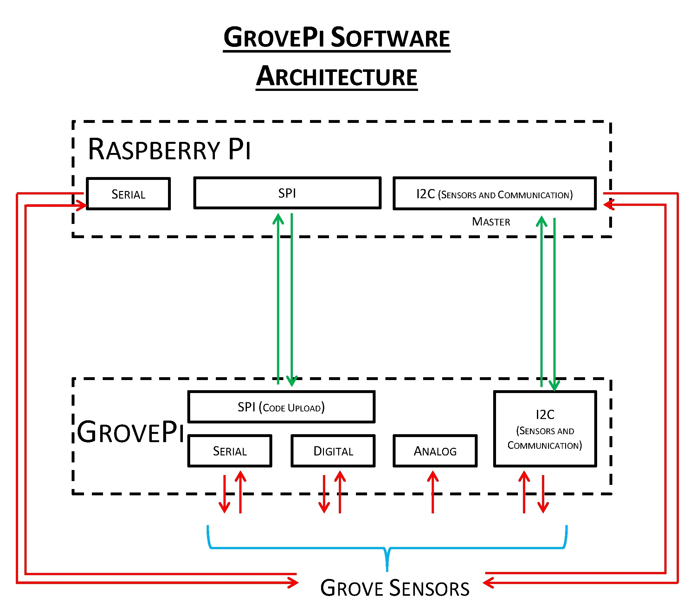

# Grove Pi Plus

## Liens
- Page officielle sur le site de Seeed Studio : [Grove Pi Plus](https://wiki.seeedstudio.com/GrovePi_Plus/)
- Page officielle sur le site de Dexter Industries : [Get started with the Grove Pi](https://www.dexterindustries.com/GrovePi/get-started-with-the-grovepi/)
- Doc Dexter sur la Library Python : [Python Library Documentation](https://www.dexterindustries.com/GrovePi/programming/python-library-documentation/)
- Anciennes images de Raspbian avant l'arrivée de Raspberry Pi OS : [Raspbian Images](https://downloads.raspberrypi.org/raspbian_full/images/) 

## Architecture du module GrovePi




## Installation
- Installer sur le RaspPi une version de RaspiOS **Buster**, la dernière version **Bullseye** (11.2022) n'est pas compatible avec GrovePi.
	- Forum Dexter Industries : [Grove-Pi Doesn’t work? Do NOT use Raspbian Bullseye!](https://forum.dexterindustries.com/t/grove-pi-doesnt-work-do-not-use-raspbian-bullseye/8664)
	- Forum Seeed Studio : [GrovePi+ “i2cdetect” does not work on Debian Bullseye](https://forum.seeedstudio.com/t/grovepi-i2cdetect-does-not-work-on-debian-bullseye/263041)
- Pour flasher la carte SD, utilisation du logiciel [Raspberry Pi Imager](https://www.raspberrypi.com/software/)
	- En cliquant sur la roue en bas à droite :
		- Activation d'ssh, de la locale et de la timezone
		- Ajout de l'utilisateur `pi` et du password `rascol`
		- hostname : `raspberrypi`
- Créer un utilisateur `pi` sur le RasPi si c'est pas déjà fait, **le script d'installation veut absolument un utilisateur `pi`**
- Installer `pip` qui n'est pas installé d'office sur le RapPi.
	```shell
	sudo apt install python3-pip
	```
	Sur buster la version de Python3 est la 3.7.3 et pip est accessible grâce à la commande `pip3` , 
	⚠️ `pip` est le gestionnaire de paquet de Python2 !
- Installer `pybind11` 
	```shell
	pip install pybind11
	```
- Utiliser la commande curl : 
	```bash
	sudo curl -kL dexterindustries.com/update_grovepi | bash
	```
	⚠️ Ne pas utiliser le [script téléchargeable depuis GitHub](https://github.com/DexterInd/GrovePi) car il génère des erreurs sur l'exécution du code python :
	```bash
	ImportError: No module named di_i2c
	```
	L'erreur est expliquée sur le forum de Dexter Industries : [No module named di_i2c](https://forum.dexterindustries.com/t/solved-no-module-named-di-i2c/7170)
- **Rebooter le RaspPi !**
- Faire un update du firmware 
	- Explications sur le site de Dexter Industries : [Updating the firmware](https://www.dexterindustries.com/GrovePi/get-started-with-the-grovepi/updating-firmware/)
	- Dans le dossier `GrovePi` :
		```shell
		sudo git fetch origin
		sudo git reset --hard
		sudo git merge origin/master
		```
	- Puis dans le dossier `GrovePi/Firmware` :
		```shell
		sudo chmod +x firmware_update.sh
		sudo ./firmware_update.sh
		```
	- Si tout s'est bien passé le terminal renvoi :
		`avrdude: safemode: Fuses OK`
- Vérification du bon fonctionnement du script
	- Aller dans le répertoire `GrovePi/Software/Python`
	- Lancer le script Python :
		```shell
		sudo python grove_firmware_version_check.py
		```
		Si la commande renvoi la version du firmware : `GrovePi has firmware version: 1.4.0` étape ok !
	- Test de la communication i2c :
		```shell
		sudo i2cdetect -y 1
		```
		Si on peut voir le 4 sur le tableau ASCII, c'est OK !
		```text
		     0  1  2  3  4  5  6  7  8  9  a  b  c  d  e  f
		00:          -- 04 -- -- -- -- -- -- -- -- -- -- --
		10: -- -- -- -- -- -- -- -- -- -- -- -- -- -- -- --
		20: -- -- -- -- -- -- -- -- -- -- -- -- -- -- -- --
		30: -- -- -- -- -- -- -- -- -- -- -- -- -- -- -- --
		40: -- -- -- -- -- -- -- -- -- -- -- -- -- -- -- --
		50: -- -- -- -- -- -- -- -- -- -- -- -- -- -- -- --
		60: -- -- -- -- -- -- -- -- -- -- -- -- -- -- -- --
		70: -- -- -- -- -- -- -- --
		```
	- Faire clignoter une LED
		- Aller dans le dossier `GrovePi/Software/Python`
		- Lancer le script :
			```shell
			sudo python grove_led_blink.py
			```
			Ajouter une LED sur D4, elle doit clignoter, `ctrl+c` pour sortir.
